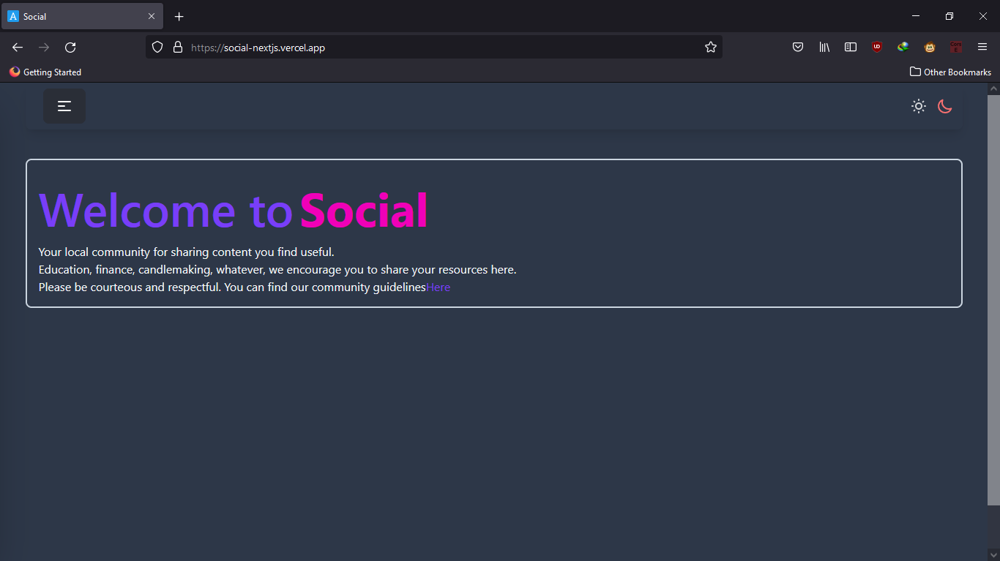

<div id="top"></div>
<br />
<div align="center">
  <a href="https://github.com/jay-bien/Social-backend">
    
  </a>

  <h1 align="center">Vent Space</h1>
<h4>For the frontend repo visit <strong><a href="https://github.com/jay-bien/Social-Frontend"> this link</a>
</strong>
</h4>
  <p align="center">
    Your ventspace
        <br />
    <a href="">
    </a>
    <br />
    <br />
    <a href="https://social-nextjs.vercel.app">View Demo</a>
    ·
    <a href="https://github.com/jay-bien/Social-backend/issues">Report Bug</a>
    ·
    <a href="https://github.com/jay-bien/Social-backend/issues">Request Feature</a>
  </p>
</div>


<!-- TABLE OF CONTENTS -->
<details>
  <summary>Table of Contents</summary>
  <ol>
    <li>
      <a href="#about-the-project">About The Project</a>
      <ul>
        <li><a href="#built-with">Built With</a></li>
      </ul>
    </li>
    <li>
      <a href="#getting-started">Getting Started</a>
      <ul>
        <li><a href="#prerequisites">Prerequisites</a></li>
        <li><a href="#installation">Installation</a></li>
      </ul>
    </li>
    <li><a href="#usage">Usage</a></li>
    <li><a href="#roadmap">Roadmap</a></li>
    <li><a href="#contributing">Contributing</a></li>
    <li><a href="#license">License</a></li>
    <li><a href="#contact">Contact</a></li>
    <li><a href="#acknowledgments">Acknowledgments</a></li>
  </ol>
</details>


<!-- ABOUT THE PROJECT -->
## About The Project





Ventspace is a text-based social media network where users can share short blocks of texts and links.

Current Features include:
* Ability to share short blocks of texts
* Ability to share links
* Can bookmark posts
* Can upvote posts
* Can downvotes posts
* Can comment on posts


<p align="right">(<a href="#top">back to top</a>)</p>


### Built With

This section should list any major frameworks/libraries used to bootstrap your project. Leave any add-ons/plugins for the acknowledgements section. Here are a few examples.
* [Typescript](https://www.typescriptlang.org/)
* [Node.js](https://nodejs.org/en/)
* [Express.js](https://expressjs.com/)
* [MondoDB](https://www.mongodb.com/)
* [Mongoose](https://mongoosejs.com/)
* [JEST](https://jestjs.io/)


<p align="right">(<a href="#top">back to top</a>)</p>


<!-- GETTING STARTED -->
## Getting Started

Follow these instructions to get this project up and running on a local machine.

### Prerequisites

This is an example of how to list things you need to use the software and how to install them.
* node@^14.17.3
* git cli
* npm
  ```sh
  npm install npm@latest -g
  ```

### Installation

To install and run the program locally:


1. Clone the repo
   ```sh
   git clone https://github.com/jay-bien/Social-backend.git
   ```
2. Navigate into folder
    ```sh
    cd social-backend
    ```
2. Install dependencies
   ```sh
   npm install
   ```
4. Create a .env file in the base directory
   ```sh
   touch .env
   ```
5. Add the following values in your .env file
    * MONGO_URL='url to remote or local mongodb'
    * JWT_KEY='Random key to use'
    * PORT='port you would like to use for the express app, defaults to 8083'
    * ORIGIN='url of the frontend that will be accessing backend api, for whitelisting'
    
    --- Example ---
    ```
    MONGO_URL=mongodb://localhost:27017/?readPreference=primary&appname=MongoDB%20Compass&ssl=false
    PORT=8083
    JWT_KEY=rkjfdasbj
    ORIGIN=http://localhost:3000
    ```
6. Start the app in development mode by running test command. Jest will run the test files and watch the directory for file changes to continuously run tests.
  ```sh
  npm run test
  ```
7. Start the app in development mode (without jest and testing) by using the dev command.
```sh
npm run dev
```
8. Start the app in production mode by building the app then starting it.
  ```sh
  npm run build
  npm run start
  ```
<p align="right">(<a href="#top">back to top</a>)</p>


<!-- USAGE EXAMPLES -->
## Usage

This app can be used in conjunction with the [front end app](https://github.com/jay-bien/Social-Frontend) or you can connect with a client such as Postman or Insomnia.

<p align="right">(<a href="#top">back to top</a>)</p>


<!-- ROADMAP -->
## Roadmap
- [x] Add authentication
- [x] Add ability to post text
- [x] Add ability to post links
- [x] Add ability to retrieve metadata from posted links
- [ ] Add ability to bookmark post
- [ ] Add ability to upvote and downvote posts
- [ ] Add ability to Comment on posts
- [ ] Add ability to view user activity
- [ ] Add ability to edit user profile
- [ ] Add ability to upload profile image
- [ ] Add ability to search text posts
- [ ] Add ability to search link posts
- [ ] Add ability to follow users
- [ ] Add feed of followed users only
- [ ] Add Changelog
- [ ] Add ability to post recorded sound clips
- [ ] Add ability to post images
- [ ] Add ability to post videos
- [ ] Add action button animations ( liking, bookmarking )
- [ ] Move from bookmarking to saving posts to custom lists
- [ ] Dockerize the app
- [ ] Multi-language Support
    - [ ] Spanish
    - [ ] French

See the [open issues](https://github.com/jay-bien/Social-backend/issues) for a full list of proposed features (and known issues).

<p align="right">(<a href="#top">back to top</a>)</p>


<!-- CONTRIBUTING -->
## Contributing

If you have a suggestion that would make this better, please fork the repo and create a pull request. You can also simply open an issue with the tag "enhancement".
Don't forget to give the project a star! Thanks again!

1. Fork the Project
2. Create your Feature Branch (`git checkout -b feature/AmazingFeature`)
3. Commit your Changes (`git commit -m 'Add some AmazingFeature'`)
4. Push to the Branch (`git push origin feature/AmazingFeature`)
5. Open a Pull Request

<p align="right">(<a href="#top">back to top</a>)</p>


<!-- LICENSE -->
## License

Distributed under the MIT License. See `LICENSE.txt` for more information.

<p align="right">(<a href="#top">back to top</a>)</p>


<!-- CONTACT -->
## Contact
Project Link: [https://github.com/jay-bien/Social-backend](https://github.com/jay-bien/Social-backend)

<p align="right">(<a href="#top">back to top</a>)</p>